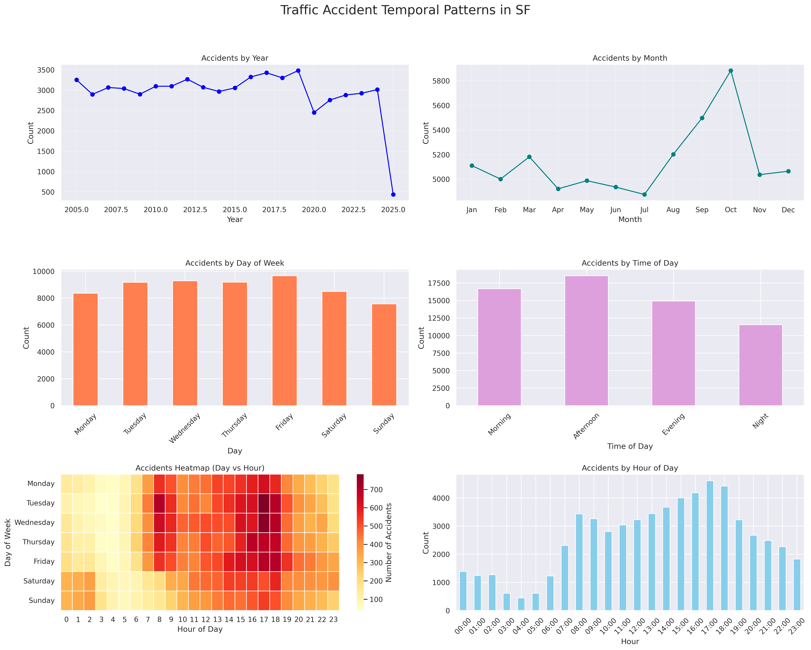
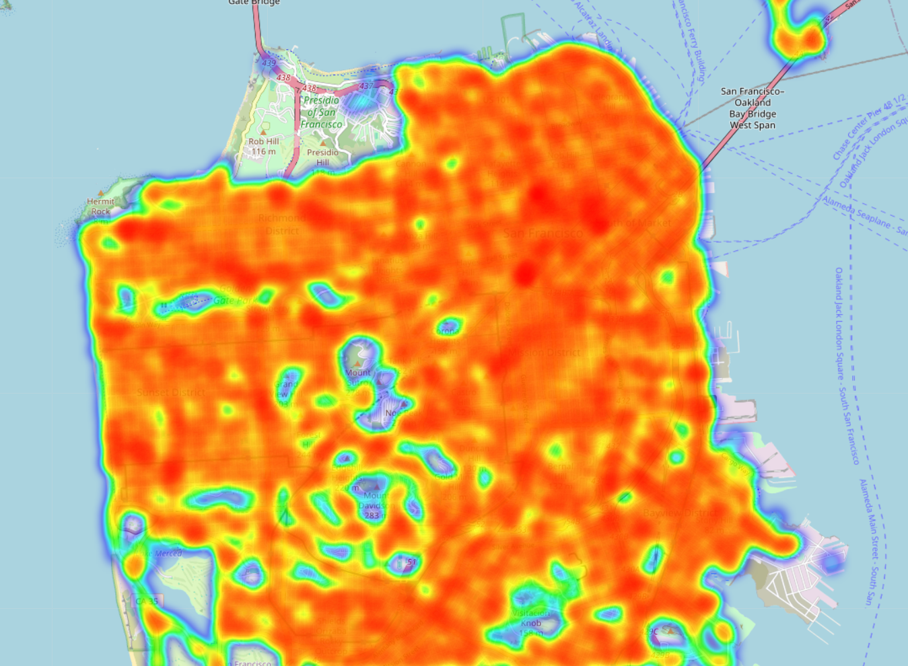
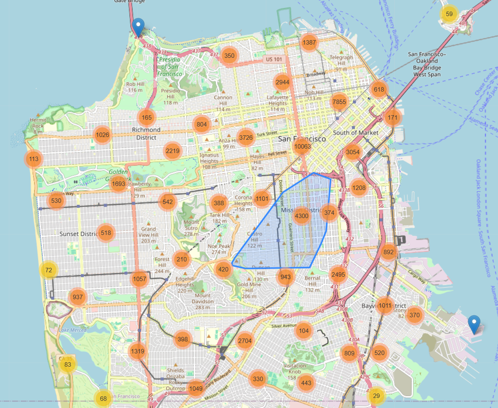
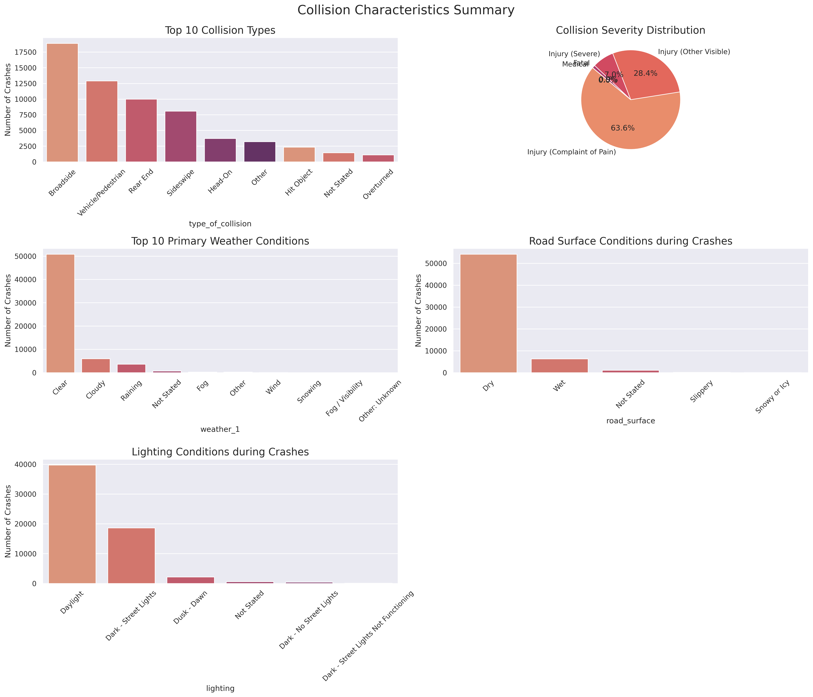
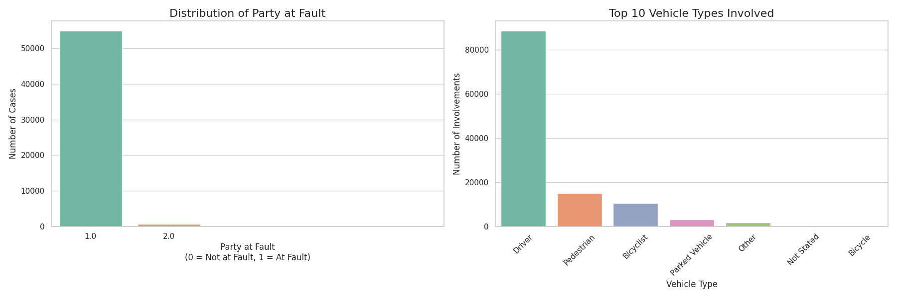

# 🚦 SF Crash Sight 2.0: San Francisco Traffic Accident Prediction & Optimization

> An intelligent system for crash hotspot analysis, severity prediction, and emergency response optimization using spatial data science.

---

## 📖 Table of Contents

- [📌 Project Overview](#-project-overview)
- [🧩 Module Breakdown](#-module-breakdown)
- [🗺️ Map Previews](#-map-previews)
- [🗂️ Project Structure](#-project-structure)
- [🛠️ Tech Stack](#-tech-stack)
- [📊 Dataset Description](#-dataset-description)
- [📈 Future Work](#-future-work)
- [📬 Contact](#-contact)

---

## 📌 Project Overview

**CrashSight SF 2.0** is a comprehensive spatial analytics system built on 61,702 traffic crash records from San Francisco. It aims to:

- Detect spatial patterns and hotspots of traffic incidents
- Predict crash severity using interpretable and scalable models
- Optimize emergency resource allocation using spatial optimization
- Visualize insights interactively for policy and operational support

---

## 🧩 Module Breakdown

### 📁 Module 1: Data Preparation & EDA

- **Data Cleaning & Feature Engineering**
  - Handled missing and inconsistent values in over 60 fields
  - Generated derived features including:
    - `is_weekend`, `is_rush_hour`, `day_of_week`, `time_of_day`
    - Simplified categories for weather (`weather_1_simple`) and road condition (`road_condition_simple`)
  - Assigned accidents to spatial grids using `cKDTree` for efficient point-to-cell matching

- **Exploratory Data Analysis**
  1. **Temporal Analysis**  
     - Plotted crash counts over `year`, `month`, `week`, and `day`
     - Visualized weekly and daily crash trends using heatmaps  
     
     

     > Yearly, monthly, weekly, and daily patterns in crash frequency

  2. **Spatial Analysis**  
     - Generated crash density heatmaps over SF using KDE  
       [](https://raw.githack.com/sunaminusone/CrashSight-SF/main/results/maps/sf_crash_heatmap.html)  
       🔗 [Click to view interactive heatmap](https://raw.githack.com/sunaminusone/CrashSight-SF/main/results/maps/sf_crash_heatmap.html)
       
     - Created severity-based cluster maps with DBSCAN  
       [](https://raw.githack.com/sunaminusone/CrashSight-SF/main/results/maps/sf_crash_cluster_map.html)  
       🔗 [Click to view interactive cluster map](https://raw.githack.com/sunaminusone/CrashSight-SF/main/results/maps/sf_crash_cluster_map.html)

     - Analyzed accident frequencies across 100+ neighborhoods using bar plots

  3. **Collision Characteristics**  
     - Investigated crash patterns based on:
       - Road surface conditions
       - Weather types
       - Lighting conditions
       - Time-of-day categories

     

     > Summary of environment conditions where crashes most commonly occur

  4. **Responsibility Analysis**  
     - Explored fault distribution and associated patterns (e.g., driver vs. pedestrian responsibility)

     

     > Distribution of responsibility in crash reports (driver, pedestrian, unknown, etc.)
---

### 🔥 Module 2: Spatial Hotspot Detection

- Conducted kernel density estimation (KDE) to visualize crash concentration
- Calculated Global Moran’s I for spatial autocorrelation
- Applied DBSCAN clustering by severity to detect spatially concentrated crash clusters
- Generated heatmaps and interactive cluster maps using Folium

---

### 🚨 Module 3: Crash Severity Prediction

- Developed binary and multinomial logistic regression models for crash severity
- Compared baseline models with tree-based classifiers (e.g., XGBoost)
- Evaluated models using cross-validation, confusion matrices, ROC-AUC, and F1-score
- Identified most influential risk factors through model coefficients and feature importance

---

### 🧭 Module 4: Resource Optimization

- Solved the **p-median facility location problem** to place emergency response stations
- Used **Voronoi diagrams** to divide service zones and evaluate coverage
- Simulated response time improvements and produced optimal layouts

---

## 🗺️ Map Previews

### 🌡️ Crash Heatmap of San Francisco (Folium)

[](https://raw.githack.com/sunaminusone/CrashSight-SF/main/results/maps/sf_crash_heatmap.html)

> 📍 Click to view full interactive heatmap

---

### 🔶 Crash Cluster Map (by Severity Level)

[](https://raw.githack.com/sunaminusone/CrashSight-SF/main/results/maps/sf_crash_cluster_map.html)

> 📍 Click to view full interactive cluster map

---

## 🗂️ Project Structure

```bash
CrashSight-SF/
│
├── data/                # Raw and processed crash datasets
├── notebooks/           # Jupyter/Colab notebooks for each module
├── src/                 # Source code (KDE, optimization, modeling)
├── results/             # Generated maps, plots, evaluation reports
│   └── maps/            # Folium interactive .html maps
│   └── output/          # Static summary plots (e.g., time series, stats)
├── figures/             # Static screenshots for README visualization
├── models/              # Trained models (e.g., .pkl, .joblib)
├── requirements.txt     # Python dependencies
├── README.md            # Project documentation
```

---

## 🛠️ Tech Stack

- **Languages**: Python 3.10+
- **Libraries**:  
  - `pandas`, `geopandas`, `matplotlib`, `scikit-learn`, `statsmodels`
  - `scipy`, `folium`, `PySAL`, `shapely`, `seaborn`
  - `ortools`, `pulp` (for optimization)
- **Visualization**: `Seaborn`, `Kepler.gl`, `Folium`, `Plotly`
- **Future UI**: `Streamlit` / `Dash`

---

## 📊 Dataset Description

- **Source**: San Francisco Open Data Portal  
- **Size**: 61,702 crash records × 63 variables  
- **Key Fields**:
  - Time: crash date, hour, day of week, rush hour
  - Space: latitude, longitude, grid ID
  - Environment: lighting, road condition, weather
  - Severity: fatal, injury, property damage

---

## 📈 Future Work

- Incorporate **spatio-temporal forecasting** using LSTM or Prophet
- Deploy interactive web dashboard (Streamlit)
- Integrate live traffic / weather feeds for real-time predictions
- Compare results with other cities for generalizability

---

## 📬 Contact

**Author**: Suna (Meixuan Li)  
📧 sunaaa@berkeley.edu  
🔗 [GitHub Profile](https://github.com/sunaminusone)  
🏫 UC Berkeley | MEng in Analytics (Class of 2025)

---

🔗 [GitHub Profile](https://github.com/sunaminusone)  
🏫 UC Berkeley | MEng in Analytics (Class of 2025)

---

