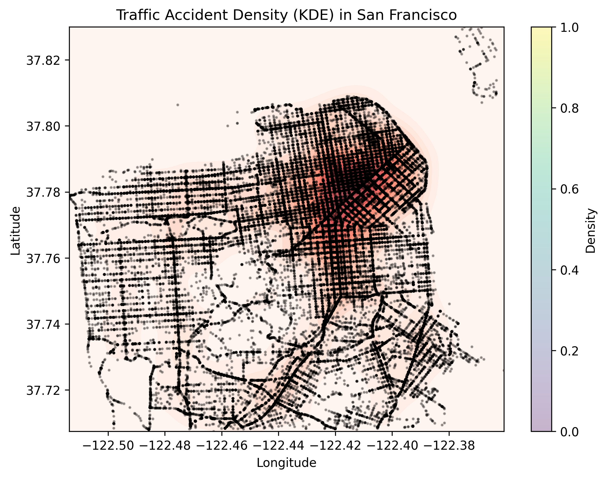
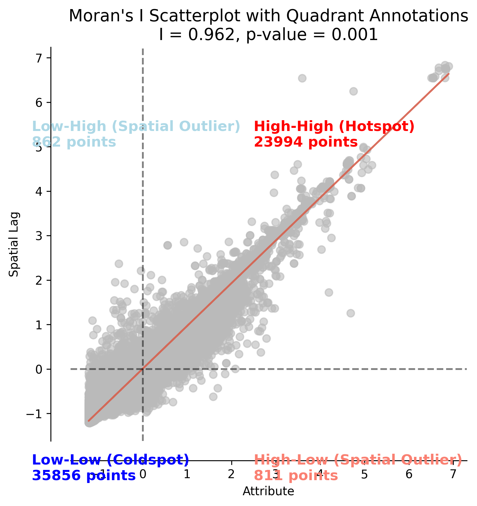
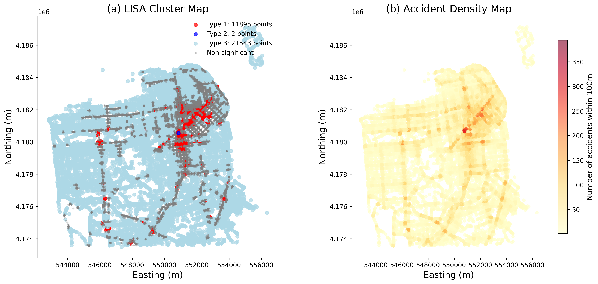
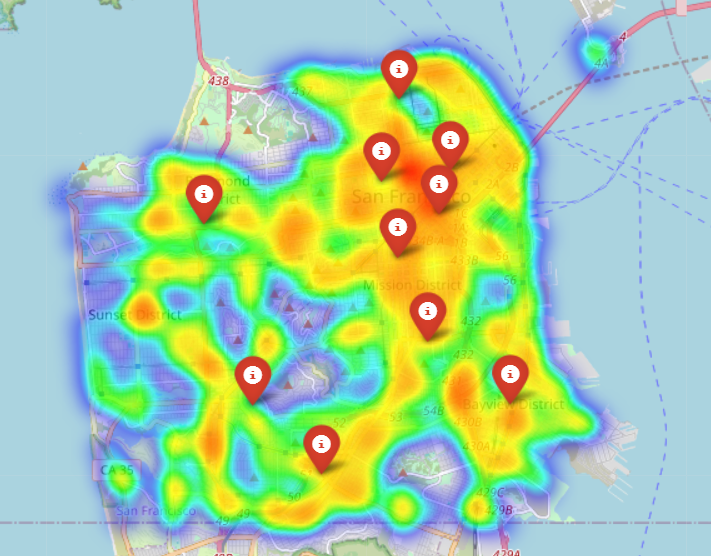
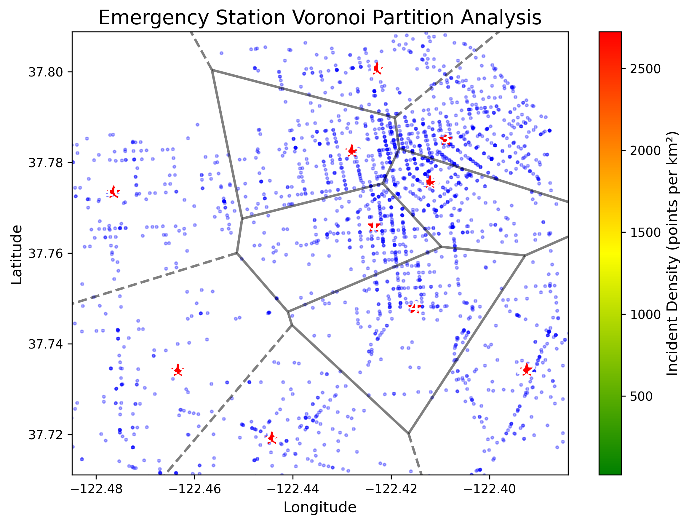
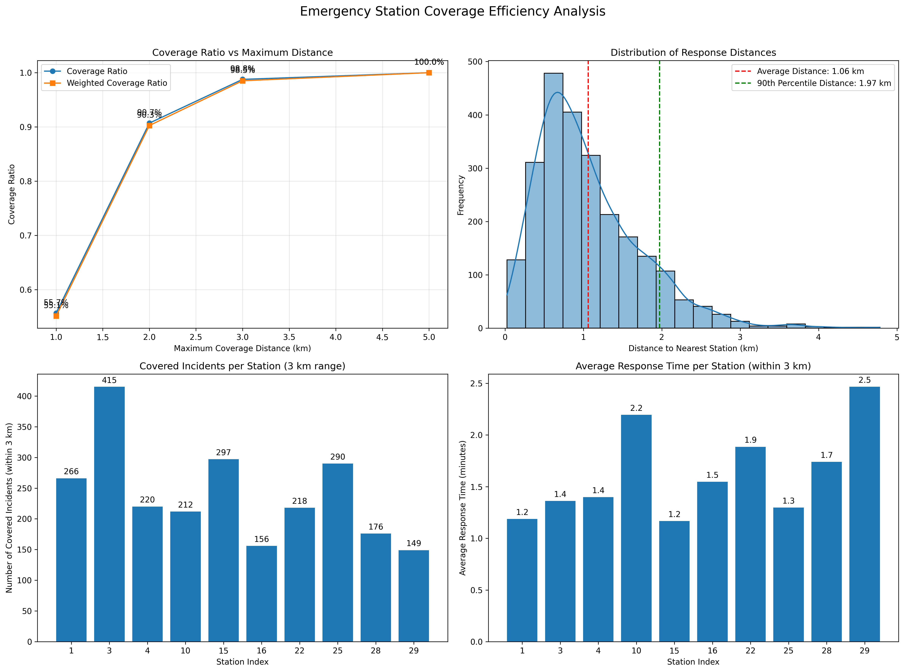
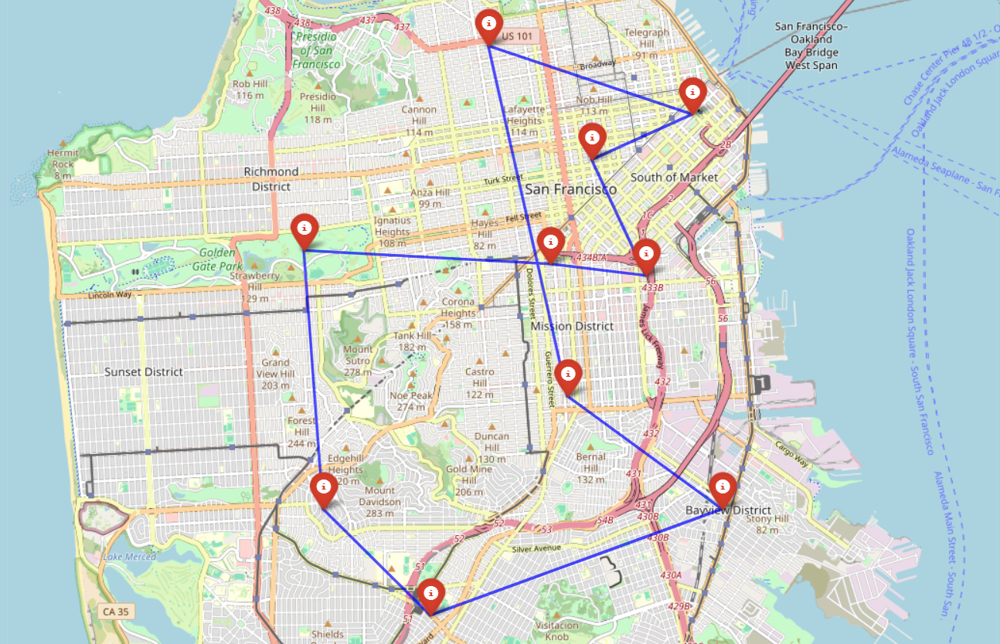

# 🚦 SF Crash Sight: San Francisco Traffic Accident Prediction & Optimization

> An intelligent system for crash hotspot analysis, severity prediction, and emergency response optimization using spatial data science.

---

## 📖 Table of Contents

- [📌 Project Overview](#-project-overview)
- [🧩 Module Breakdown](#-module-breakdown)
- [🗺️ Map Previews](#-map-previews)
- [🗂️ Project Structure](#-project-structure)
- [🛠️ Tech Stack](#-tech-stack)
- [📊 Dataset Description](#-dataset-description)
- [📈 Future Work](#-future-work)
- [📬 Contact](#-contact)

---

## 📌 Project Overview

**CrashSight SF 2.0** is a comprehensive spatial analytics system built on 61,702 traffic crash records from San Francisco. It aims to:

- Detect spatial patterns and hotspots of traffic incidents
- Predict crash severity using interpretable and scalable models
- Optimize emergency resource allocation using spatial optimization
- Visualize insights interactively for policy and operational support

---

## 🧩 Module Breakdown

### 📁 Module 1: Data Preparation & EDA

- **Data Cleaning & Feature Engineering**
  - Handled missing and inconsistent values in over 60 fields
  - Generated derived features including:
    - `is_weekend`, `is_rush_hour`, `day_of_week`, `time_of_day`
    - Simplified categories for weather (`weather_1_simple`) and road condition (`road_condition_simple`)
  - Assigned accidents to spatial grids using `cKDTree` for efficient point-to-cell matching

- **Exploratory Data Analysis**
  1. **Temporal Analysis**  
     - Plotted crash counts over `year`, `month`, `week`, and `day`
     - Visualized weekly and daily crash trends using heatmaps  
     
     

     > Yearly, monthly, weekly, and daily patterns in crash frequency

  2. **Spatial Analysis**  
     - Generated crash density heatmaps over SF using KDE  
       [](https://raw.githack.com/sunaminusone/CrashSight-SF/main/results/maps/sf_crash_heatmap.html)  
       🔗 [Click to view interactive heatmap](https://raw.githack.com/sunaminusone/CrashSight-SF/main/results/maps/sf_crash_heatmap.html)
       
     - Created severity-based cluster maps with DBSCAN  
       [](https://raw.githack.com/sunaminusone/CrashSight-SF/main/results/maps/sf_crash_cluster_map.html)  
       🔗 [Click to view interactive cluster map](https://raw.githack.com/sunaminusone/CrashSight-SF/main/results/maps/sf_crash_cluster_map.html)

     - Analyzed accident frequencies across 100+ neighborhoods using bar plots

  3. **Collision Characteristics**  
     - Investigated crash patterns based on:
       - Road surface conditions
       - Weather types
       - Lighting conditions
       - Time-of-day categories

     

     > Summary of environment conditions where crashes most commonly occur

  4. **Responsibility Analysis**  
     - Explored fault distribution and associated patterns (e.g., driver vs. pedestrian responsibility)

     

     > Distribution of responsibility in crash reports (driver, pedestrian, unknown, etc.)
---

### 🔥 Module 2: Spatial Hotspot Detection

This module focuses on identifying high-risk zones and evaluating the spatial autocorrelation of crash incidents across San Francisco.

---

#### 🔵 1. Kernel Density Estimation (KDE)

- KDE was used to create a continuous surface representing crash concentration intensity across the city.
- Interactive and static visualizations were generated for visual analysis.

[](https://raw.githack.com/sunaminusone/CrashSight-SF/main/results/spatial_analysis/kde_interactive.html)  
🔗 [Click to view interactive KDE map](https://raw.githack.com/sunaminusone/CrashSight-SF/main/results/spatial_analysis/kde_interactive.html)

---

#### 🧠 2. Global Moran's I Spatial Autocorrelation

- Moran’s I statistic was computed to assess the degree of overall spatial clustering of traffic accident counts across all grid regions.



##### **Global Moran's I Results**:

- **Moran's I**: `0.962`  
- **p-value**: `0.001`  
- **z-score**: `530.032`

##### **Interpretation**:

| Moran's I       | Meaning                                                          |
|-----------------|------------------------------------------------------------------|
| Close to **+1** | Strong clustering (high values near high, low near low)         |
| Around **0**    | Random distribution                                              |
| Close to **-1** | Strong dispersion (high values near low, or low near high)      |

➡️ Interpretation: The results suggest **extremely strong spatial clustering** of crash counts across the city.

---

#### 🔍 3. Local Indicators of Spatial Association (LISA)

- LISA identifies **local clusters** of high or low crash density and potential spatial outliers.
- Optimized subplots below visualize spatial regions categorized as:
  - High-High (hotspots)
  - Low-Low (coldspots)
  - High-Low / Low-High (spatial outliers)



##### **LISA Quadrant Summary**

The table below summarizes the quadrant assignment of all spatial units based on local Moran's I values:

| Quadrant                  | Number of Points | Interpretation                                                                 |
|---------------------------|------------------|---------------------------------------------------------------------------------|
| High-High (Hotspot)       | 23,994           | Areas with high accident density surrounded by similarly high-density areas (critical accident hotspots). |
| Low-High (Spatial Outlier)| 862              | Areas with low accident density but surrounded by high-density areas (possible transition zones or anomalies). |
| Low-Low (Coldspot)        | 35,856           | Areas with low accident density surrounded by other low-density areas (generally safe regions). |
| High-Low (Spatial Outlier)| 811              | Areas with high accident density but surrounded by low-density areas (isolated hotspots). |

---

### 🧠 Summary Insights

- **Spatial clustering**:  
  Traffic accidents in San Francisco exhibit strong spatial clustering, particularly in central urban areas and major corridors.

- **Cluster confirmation**:  
  High-High regions in the LISA map closely match KDE hotspots, reinforcing the validity of identified crash-prone zones.

- **Emerging risk zones**:  
  Low-High outliers (light blue) may evolve into future hotspots and warrant proactive monitoring.

- **Strategic recommendations**:  
  - Prioritize traffic safety interventions in High-High zones, such as enhanced signal control, increased patrol presence, and public awareness campaigns.
  - Apply preventive surveillance in Low-High fringe zones to mitigate potential hotspot expansion.

---

### 🚨 Module 3: Crash Risk Prediction Modeling

This module aims to predict **whether a specific grid cell will experience a serious traffic accident** based on geometric and environmental features. The objective is to support proactive resource allocation and risk management.

---

#### 🔧 Model Overview

- **Model Type**: Binary Logistic Regression  
- **Target Variable**: `has_accident` (1 = accident occurs in the grid, 0 = not)

---

#### 🧠 Feature Engineering

- Derived geometric features from accident points, such as:
  - `shape_complexity`: degree of spatial irregularity in the grid
  - `dist_to_intersection`: proximity to nearest road intersection
  - `seasonality_index`: crash intensity related to time-of-year

- Integrated **traffic volume and travel behavior** data using Google Maps API:

> API Docs: [Google Maps Distance Matrix API](https://developers.google.com/maps/documentation/distance-matrix)

Examples of features extracted via API:
- Estimated driving time to major intersections or highways
- Time-of-day congestion estimates
- Travel speed variation across weekdays vs. weekends

---

#### 📊 Model Performance

The model achieved **80% accuracy** and an **AUC of 0.8553**, indicating strong ability to discriminate between accident-prone and low-risk grid areas.

- **Top 3 important predictors**:
  1. `traffic_volume`
  2. `dist_to_intersection`
  3. `shape_complexity`

---

#### 📉 Confusion Matrix

```
[[363 121]
 [ 81 434]]
```

---

#### 📝 Classification Report

```
              precision    recall  f1-score   support

           0       0.82      0.75      0.78       484
           1       0.78      0.84      0.81       515

    accuracy                           0.80       999
   macro avg       0.80      0.80      0.80       999
weighted avg       0.80      0.80      0.80       999
```

---

#### 📈 ROC-AUC Score

- **AUC Score**: `0.8553`

---

### ✅ Conclusion

The logistic regression model demonstrates strong predictive power in identifying high-risk grid regions in San Francisco. With interpretable coefficients and consistent performance across metrics, it provides a solid foundation for real-world traffic risk management.

This grid-based approach transforms complex point-level crash data into actionable, location-specific insights — enabling spatially targeted safety interventions and resource allocation strategies.

---

### 🧭 Module 4: Emergency Resource Optimization

This module develops an optimized strategy for deploying emergency service stations (e.g., ambulances, patrol units) based on predicted crash hotspots across San Francisco.

---

#### 🎯 Objective

- Select the **best 10 locations out of 40 potential sites** to install emergency stations.
- Maximize crash coverage and minimize average response distance.
- Ensure each accident-prone area is served by its nearest active station.

---

#### 🧮 p-Median Optimization Model

Let:

- **I**: Set of demand points (e.g., predicted accident hotspots)  
- **J**: Set of potential facility sites  
- **dᵢⱼ**: Distance between demand point *i* and facility *j*  
- **xᵢⱼ ∈ {0,1}**: Whether demand point *i* is assigned to facility *j*  
- **yⱼ ∈ {0,1}**: Whether facility *j* is selected  

**Objective:**

> Minimize total weighted distance between demand points and their assigned facilities:

```
Minimize ∑ᵢ∈I ∑ⱼ∈J ( dᵢⱼ × xᵢⱼ )
```

**Subject to:**

1. **Each demand point must be assigned to exactly one facility:**

```
For all i ∈ I:   ∑ⱼ∈J xᵢⱼ = 1
```

2. **Assignment can only occur if a facility is opened:**

```
For all i ∈ I, j ∈ J:   xᵢⱼ ≤ yⱼ
```

3. **Exactly P facilities must be selected (e.g., P = 10):**

```
∑ⱼ∈J yⱼ = 10
```

---

#### 📍 Selected Station Map

[](https://raw.githack.com/sunaminusone/CrashSight-SF/main/results/output/emergency_stations_map.html)  
🔗 [Click to view interactive station map](https://raw.githack.com/sunaminusone/CrashSight-SF/main/results/output/emergency_stations_map.html)

---

#### 📐 Voronoi Service Zones

Each selected site’s spatial coverage was visualized using **Voronoi tessellation**, which partitions the city into service zones based on nearest-distance assignment.

[](https://raw.githack.com/sunaminusone/CrashSight-SF/main/results/output/voronoi_map_P8.html)  
🔗 [Click to view interactive Voronoi map](https://raw.githack.com/sunaminusone/CrashSight-SF/main/results/output/voronoi_map_P8.html)

---

#### 📊 Coverage Efficiency Analysis

- A multi-distance evaluation was conducted to assess the percent of crash-prone areas that fall within key distance thresholds (e.g., 0.5 km, 1 km).
- Weighted and unweighted coverage ratios were calculated across all Voronoi zones.



---

### ✅ Optimization Outcome

- The selected stations achieved strong geographic coverage over predicted crash hotspots.
- Voronoi analysis helped visualize blind zones and overlapping regions.
- The approach provides a **scalable and explainable resource allocation strategy** for public safety departments or emergency planners.

---

### 🚓 Module 5: Patrol Route Optimization (TSP)

This module builds on the emergency station deployment strategy by designing an **optimized patrol route** that visits all predicted crash hotspots with minimal travel distance. The goal is to support efficient routing for mobile patrol units (e.g., police, EMS).

---

#### 🎯 Problem Statement

- Given a set of high-risk grid locations (identified via KDE or LISA) and selected emergency stations, we aim to find the **shortest loop that visits all patrol targets**.
- The problem is formulated as a **Traveling Salesman Problem (TSP)**, where a single patrol vehicle starts and ends at the depot and visits all locations exactly once.

---

#### 🧮 Traveling Salesman Problem (TSP) – Mathematical Formulation

Let:

- **N**: Set of crash hotspot nodes (to be patrolled)  
- **dᵢⱼ**: Distance between node *i* and node *j*  
- **xᵢⱼ** ∈ {0,1}: Binary variable indicating if the route goes directly from node *i* to node *j*  
- **uᵢ**: Helper variable to eliminate subtours (used in MTZ formulation)

**Objective**  
Minimize the total travel distance:

```
Minimize  ∑ᵢ∈N ∑ⱼ∈N ( dᵢⱼ × xᵢⱼ )
```

**Subject to:**

1. **Each node must be entered exactly once:**

```
For all j ∈ N:   ∑ᵢ∈N xᵢⱼ = 1
```

2. **Each node must be exited exactly once:**

```
For all i ∈ N:   ∑ⱼ∈N xᵢⱼ = 1
```

3. **Subtour Elimination Constraints (Miller–Tucker–Zemlin):**

```
For all i ≠ j ∈ {2, ..., n}:   uᵢ - uⱼ + n × xᵢⱼ ≤ n - 1
```

4. **Binary decision variables:**

```
xᵢⱼ ∈ {0, 1}    for all i, j ∈ N
```

> 📚 Reference: [Miller–Tucker–Zemlin formulation](https://en.wikipedia.org/wiki/Travelling_salesman_problem#Integer_linear_programming_formulation)

---

#### 📈 Optimized Patrol Route Output

The following table shows the optimal visiting sequence for 10 key crash hotspots:

| From Node | To Node | Distance (meters) |
|-----------|---------|-------------------|
| 0         | 13      | 1791.31           |
| 13        | 24      | 2324.15           |
| 24        | 23      | 2031.49           |
| 23        | 16      | 4274.71           |
| 16        | 7       | 6014.95           |
| 7         | 22      | 4231.11           |
| 22        | 28      | 5834.92           |
| 28        | 29      | 2897.97           |
| 29        | 34      | 4315.37           |
| 34        | 1       | 4508.09           |

> **Total Patrol Distance**: **38,224.06 meters**

---

#### 🗺️ Route Visualization

[](https://raw.githack.com/sunaminusone/CrashSight-SF/main/results/output/patrol_route.html)  
🔗 [Click to view interactive patrol route map](https://raw.githack.com/sunaminusone/CrashSight-SF/main/results/output/patrol_route.html)

> The map shows a closed-loop route connecting all selected hotspots, beginning and ending at the depot.

---

### ✅ Conclusion

- The optimized patrol path efficiently connects all high-risk zones using a single vehicle.
- This TSP-based strategy minimizes redundant travel and improves spatial patrol planning.
- Future extensions may explore **multi-vehicle patrols (M-TSP)** or **dynamic routing based on real-time crash risk updates**.

---

## 🗂️ Project Structure

```bash
CrashSight-SF/
│
├── data/                # Raw and processed crash datasets
├── notebooks/           # Jupyter/Colab notebooks for each module
├── src/                 # Source code (KDE, optimization, modeling)
├── results/             # Generated maps, plots, evaluation reports
│   └── maps/            # Folium interactive .html maps
│   └── output/          # Static summary plots (e.g., time series, stats)
├── figures/             # Static screenshots for README visualization
├── models/              # Trained models (e.g., .pkl, .joblib)
├── requirements.txt     # Python dependencies
├── README.md            # Project documentation
```

---

## 🛠️ Tech Stack

- **Languages**: Python 3.10+
- **Libraries**:  
  - `pandas`, `geopandas`, `matplotlib`, `scikit-learn`, `statsmodels`
  - `scipy`, `folium`, `PySAL`, `shapely`, `seaborn`
  - `ortools`, `pulp` (for optimization)
- **Visualization**: `Seaborn`, `Kepler.gl`, `Folium`, `Plotly`
- **Future UI**: `Streamlit` / `Dash`

---

## 📊 Dataset Description

- **Source**: San Francisco Open Data Portal  
- **Size**: 61,702 crash records × 63 variables  
- **Key Fields**:
  - Time: crash date, hour, day of week, rush hour
  - Space: latitude, longitude, grid ID
  - Environment: lighting, road condition, weather
  - Severity: fatal, injury, property damage

---

## 📈 Future Work

- Incorporate **spatio-temporal forecasting** using LSTM or Prophet
- Deploy interactive web dashboard (Streamlit)
- Integrate live traffic / weather feeds for real-time predictions
- Compare results with other cities for generalizability

---

## 📬 Contact

**Author**: Suna (Meixuan Li)  
📧 sunaaa@berkeley.edu  
🔗 [GitHub Profile](https://github.com/sunaminusone)  
🏫 UC Berkeley | MEng in Analytics (Class of 2025)

---


